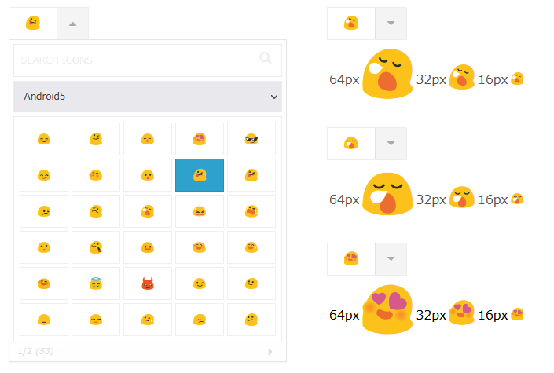

# yellow-blob-picker

This is a jquery plugin that uses Yellow blob, which was used in Android 5 and 7, as an icon picker.



A list of [available icons](https://etc.imo-tikuwa.com/yellow-blob-picker/dist/demo.html) and a [demo](https://etc.imo-tikuwa.com/yellow-blob-picker/dist/demo_iconpicker.html) of the icon picker.

## Usage
1. Load `jquery.yellow-blob-picker.css` in the head.
```html
<link rel="stylesheet" href="css/jquery.yellow-blob-picker.css">
```

2. Load `jquery.yellow-blob-picker.js` after loading jquery.
```html
<script src="https://code.jquery.com/jquery-3.6.0.min.js"></script>
<script type="text/javascript" src="js/jquery.yellow-blob-picker.js"></script>
```

3. Call yellowBlobPicker().
```html
<input type="text" id="icon-picker" name="picker1" />
```
```javascript
<script type="text/javascript">
  $('#icon-picker').yellowBlobPicker();
</script>
```

### About icon display outside the icon picker.
You can display the yellow-blob icon outside the icon picker by using the `$.createYellowBlobIcon` function.
```javascript
<script type="text/javascript">
  let icon = 'android5-u1f60a';
  $('.display-icon').html($.createYellowBlobIcon(icon));
</script>
```

### Example.
Display the icon picker. And show the selected icon in the .display-icon element when the "change" event fires.
```html
<input type="text" id="icon-picker" name="picker1" />
<div class="display-icon" style="font-size:64px"></div>
<div class="display-icon" style="font-size:32px"></div>
<div class="display-icon" style="font-size:16px"></div>
```
```javascript
<script type="text/javascript">
  $(() => {
    let $picker = $('#icon-picker').yellowBlobPicker({
      iconsPerPage: 30,
      emptyIcon: false,
    });
    $picker.on('change', e => {
      $('.display-icon').html($.createYellowBlobIcon(e.target.value));
    });
    $('.display-icon').html($.createYellowBlobIcon($picker.val()));
  });
</script>
```

## Options
The icon picker itself uses the [fontIconPicker](https://github.com/fontIconPicker/fontIconPicker) plugin.  
Therefore, among the options of the fontIconPicker plugin, options other than "source" and "iconGenerator" can be used as they are.

## Credits
 - The [emoji](https://github.com/googlefonts/noto-emoji) embedded within the plugin is licensed under the Apache License 2.0.
 - The [fontIconPicker](https://github.com/fontIconPicker/fontIconPicker) embedded within the plugin is licensed by MIT.
